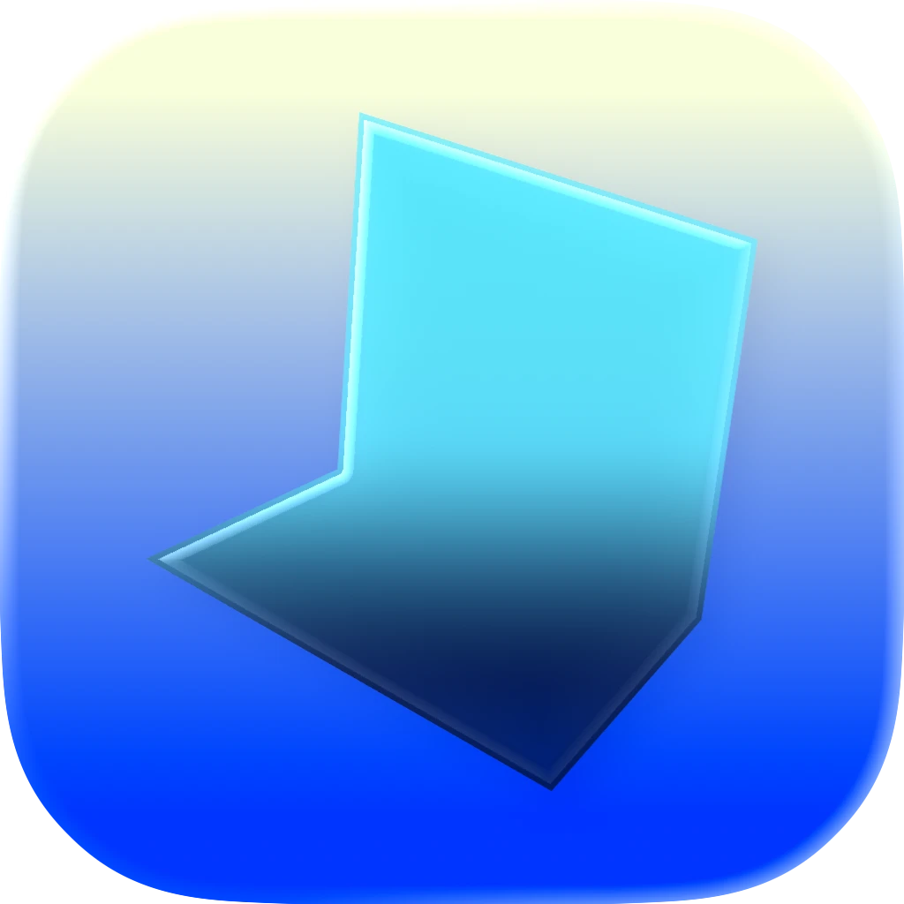
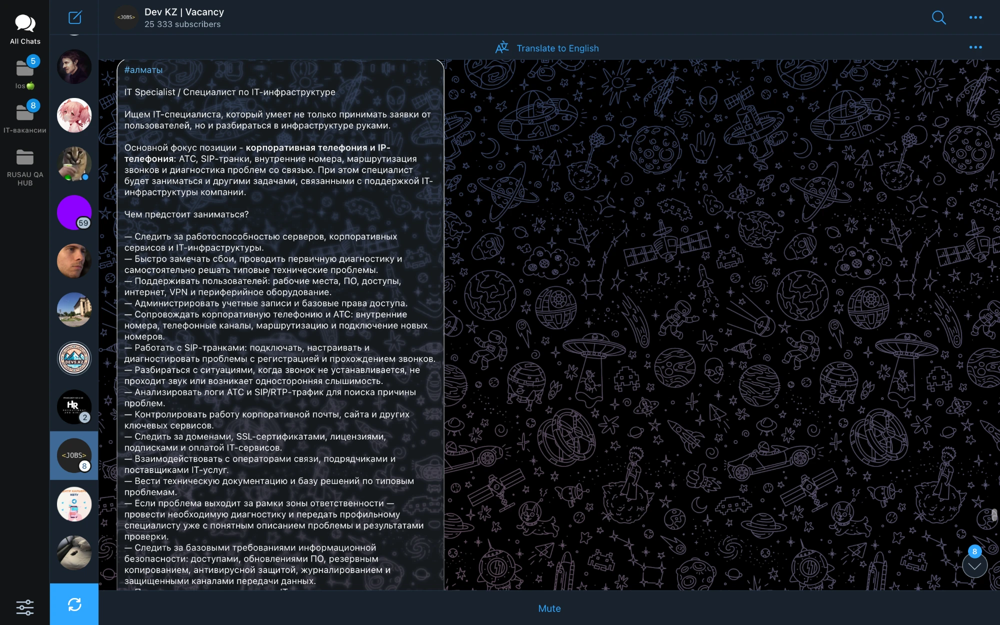
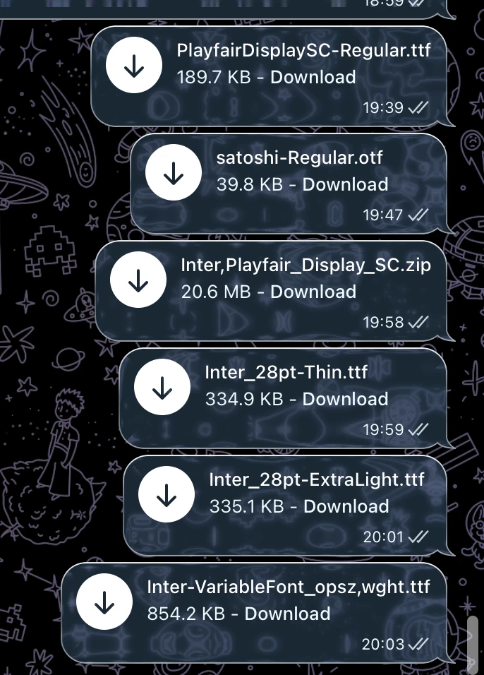
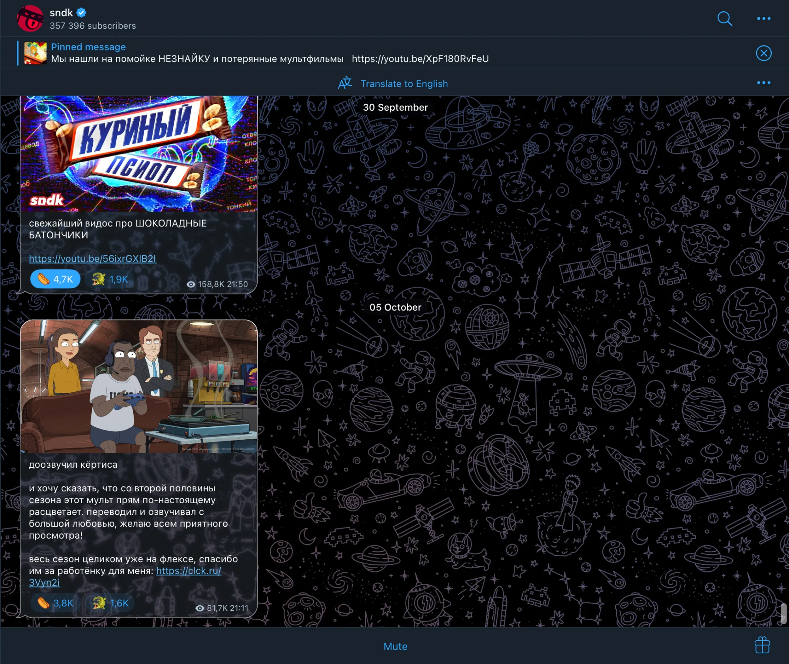

<div align="center">
  

  <h2 align="center">Glassgram</h2>
  <p align="center">An unofficial Telegram client for macOS with Liquid Glass message bubbles.</p>
</div>



**Glassgram** is a fork of [Telegram for macOS](https://github.com/overtake/TelegramSwift) that redesigns message bubbles using Apple's Liquid Glass (`NSGlassEffectView`, macOS 26). It is **not affiliated with or endorsed by Telegram**.

## What's new in Glassgram

### Liquid Glass message bubbles
On macOS 26 and later, message bubbles are clear glass instead of a solid color:

- **Clear glass** – the chat wallpaper shows through every bubble, lightly tinted with your theme's bubble color.
- **Bright glass rim** – a thin white edge that is brightest at the top and fades along the sides, like light catching real glass.
- **Exact bubble shape** – the glass and the rim follow Telegram's bubble shape, tail included.
- **Automatic fallback** – on macOS versions before 26, bubbles look the same as in Telegram.

| Glass bubbles | Channel view |
|---|---|
|  |  |

The look can be tuned with the constants at the top of [`Telegram-Mac/ChatGradientModel.swift`](Telegram-Mac/ChatGradientModel.swift):

```swift
private let glassTintAlpha: CGFloat = 0.25      // 0 = colorless glass, 1 = solid theme color
private let glassRimTopAlpha: CGFloat = 0.95    // rim brightness at the top edge
private let glassRimMiddleAlpha: CGFloat = 0.2  // rim brightness on the sides
private let glassRimBottomAlpha: CGFloat = 0.55 // rim brightness at the bottom edge
```

Glass looks best over a photo or pattern wallpaper (Settings → Appearance → Chat Background).

### Other changes from Telegram for macOS
- **New app icon** made with Icon Composer (`Telegram-Mac/GlassGramIcon.icon`).
- **Own bundle identifier** (`com.raimbek.Glassgram`), App Groups and keychain groups, so Glassgram can run alongside the official Telegram app.
- **Firebase removed** – Telegram's crash reporting and analytics (configured with Telegram's own Firebase project) are no longer linked into the app.
- **Builds with Xcode 26 on Apple Silicon** – see the build notes below.

## Requirements
- macOS 26 or later for the glass effect (the app itself runs on macOS 13+)
- Xcode 26
- Apple Silicon or Intel Mac

## How to Build

1. Clone with submodules:
   ```
   git clone --recurse-submodules https://github.com/Raimbek-pro/Glassgram.git
   ```
2. Install build tools:
   ```
   brew install cmake ninja meson zlib autoconf libtool automake yasm pkg-config openssl@3
   ```
3. Build the bundled libraries (OpenSSL, ffmpeg, webrtc and others). This takes a while:
   ```
   export CMAKE_POLICY_VERSION_MINIMUM=3.5
   sh scripts/configure_frameworks.sh
   ```
   If a library fails, delete its `core-xprojects/<library>/build` folder before running the script again – the script skips any library whose `build` folder already exists.
4. Get your own API ID at [my.telegram.org](https://my.telegram.org) and put `apiId`, `apiHash` and your `teamId` in `packages/ApiCredentials/Sources/ApiCredentials/Config.swift`. **Never commit your `api_hash`.**
5. Open `Telegram-Mac.xcworkspace`, set your signing team on the **Telegram**, **TelegramShare** and **FocusIntents** targets, choose the **Telegram** scheme and **My Mac**, and press **⌘R**.
   When Xcode asks to download the **Metal Toolchain**, accept – the app uses Metal shaders.

### Fixes for Xcode 26 / Apple Silicon included in this fork
- `ffmpeg` build script points at the bundled `ffmpeg-7.1.1` source (upstream looks for `7.1`).
- `CMAKE_POLICY_VERSION_MINIMUM=3.5` lets older libraries (mozjpeg) configure with CMake 4.
- Removed a hardcoded Intel-only `libswiftAppKit.dylib` linker flag that broke arm64 builds once the Metal Toolchain is installed.
- Minimum macOS for the app and its extensions raised to 13.0, and Swift standard libraries are no longer embedded.

## License
Glassgram is licensed under the GNU General Public License, version 2.0, like Telegram for macOS. See [LICENSE](LICENSE).

## Credits
Based on [Telegram for macOS](https://github.com/overtake/TelegramSwift) by Telegram. Following Telegram's [forking requirements](https://github.com/overtake/TelegramSwift#forking), Glassgram uses its own API ID, its own name and icon, and its full source code is published here.

Bugs and ideas for Glassgram: [open an issue](https://github.com/Raimbek-pro/Glassgram/issues). Please don't report Glassgram bugs to Telegram.
